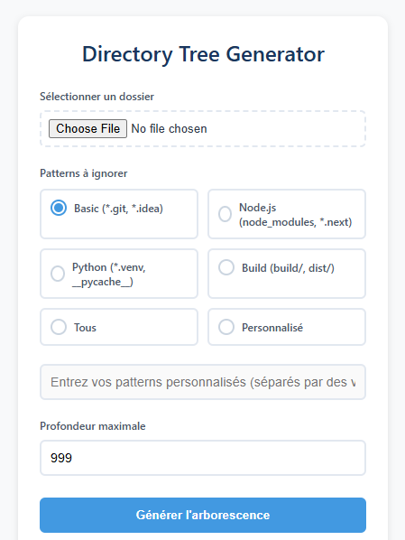

# 🌳 Directory Tree Generator - Chrome Extension

> Generate beautiful directory trees to help AI understand your project structure! 🤖✨

## 📖 Overview

This Chrome extension allows you to easily generate a directory tree visualization of any folder on your computer. Perfect for:
- 🤖 Sharing your project structure with AI models
- 📚 Documentation purposes
- 🎯 Getting a clear overview of your codebase
- 🔍 Code review discussions

## 🖼️ Screenshots

### Main Interface



### Example Output


## ✨ Features

- 🔍 Scan any local directory
- ⚡ Real-time tree generation
- 🎯 Customizable ignore patterns
- 📏 Adjustable depth level
- 📋 One-click copy to clipboard
- 🎨 Clean and intuitive interface

## 🚀 Installation

1. Clone this repository
```bash
git clone https://github.com/h-mbl/directory_tree_extension.git
```

2. Open Chrome and navigate to:
```
chrome://extensions/
```

3. Enable "Developer mode" in the top right corner 🛠️

4. Click "Load unpacked" and select the extension directory 📂

## 💡 How to Use

1. Click the extension icon in your Chrome toolbar
2. Select a directory to analyze 📁
3. Choose which patterns to ignore (optional):
    - Basic (*.git, *.idea)
    - Node.js (node_modules, *.next)
    - Python (*.venv, __pycache__)
    - Build files (build/, dist/)
    - Custom patterns
4. Set maximum depth level (if needed)
5. Click "Generate Tree" 🚀
6. Copy the result with one click! 📋

## 🧠 Using with AI Models

This tool is particularly useful when working with AI models! Here's how:

1. Generate your project's tree structure
2. Copy it to your clipboard
3. Share it with AI (like Claude) to:
    - Get project architecture feedback
    - Discuss refactoring strategies

The tree structure helps AI models better understand your project's organization! 🎯

## 🔧 Technical Details

### How it Works

The extension uses a multi-step process to generate the tree:

1. **File Selection** 📁
    - Uses the `webkitdirectory` attribute for folder selection
    - Handles file system access via Chrome's API

2. **Pattern Matching** 🎯
    - Converts glob patterns to regex
    - Filters files and directories based on ignore patterns

3. **Tree Generation** 🌳
    - Builds an in-memory tree structure
    - Sorts directories first, then files
    - Generates ASCII tree visualization
    - Handles proper indentation and branch characters

### Code Structure

```
extension/
├── manifest.json    # Extension configuration
├── popup.html      # User interface
├── popup.js        # Core functionality
└── styles.css      # Visual styling
```

## 🤝 Contributing

Feel free to contribute! Here's how:

1. Fork the repository
2. Create your feature branch
3. Commit your changes
4. Push to the branch
5. Open a Pull Request

## 🐛 Known Issues

- Chrome will ask for folder access permission each time (this is a security feature)
- [Add any other known issues]

## 🎯 Future Improvements

- [ ] Save ignore pattern preferences
- [ ] improve ignore pattern choice
- [ ] Export to different formats
- [ ] Add file size information
- [ ] Custom tree characters option

